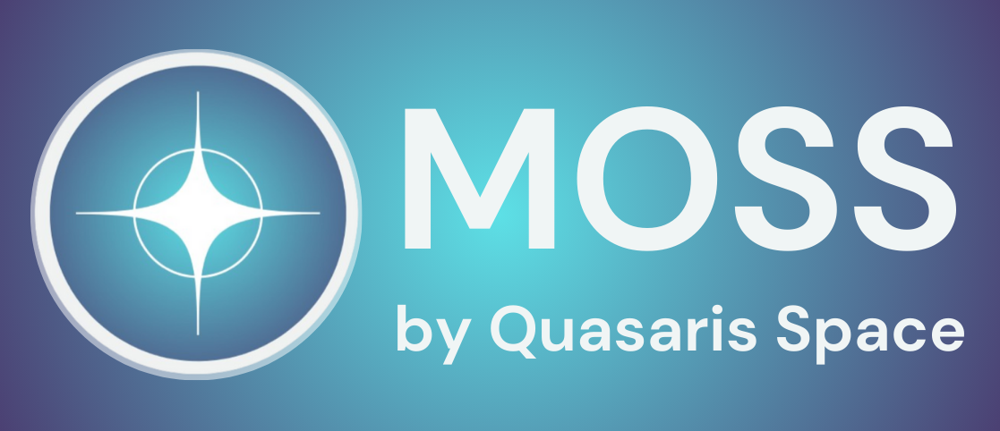

# Modular Operations Software Stack (MOSS) by Quasaris Space

Status: MVP In Progress

Plans:
- Ground Station: Display OBC data in a GUI, displays radio Transmissions from ground station RX SDR
- OBC: Recieves simulated sensor data from Basilisk environment, uses closed loop controls for attitude control

Terms:
- gs: ground station
- obc: on-board computer