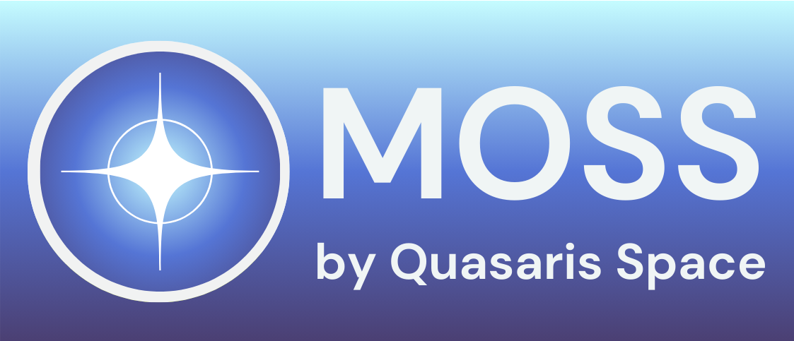
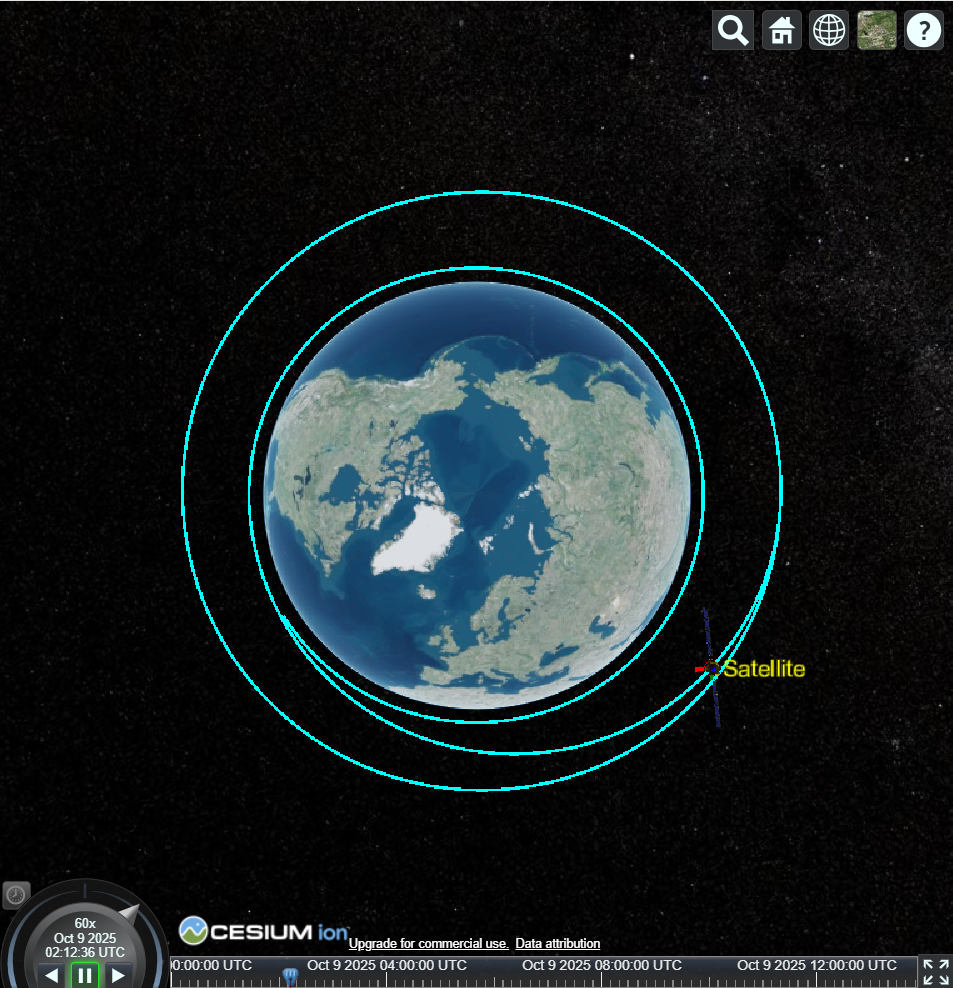

# Modular Orbital Simulations Stack (MOSS)

<div align="center">
    
</div>

---
## About MOSS
### What is MOSS?
Prototype for a more affordable and flexible framework for processor-in-the-loop simulations for GNC algorithms.

### Project Objectives
* Address the demand for validating and visualizing GNC algorithms on ARM Cortex-M based flight controllers, where parameters can be changed easily for varying mission requirements.
* Demonstrate a closed loop feedback system and execute simplified orbit positioning and attitude maneuvers, with resulting trajectories being computed and visualized in a 3D environment. 
* Provide a low-cost, scalable & modular test framework for rapid GNC prototyping, reduced barriers of entry for research, and proof of concept validation for early-stage missions.

### Project Brief
* *Target Audience*: Aimed at small scale institutions in need of a cheaper alternative for prototyping their GNC embedded software systems
* *Use Case*: Used for processor-in-the-loop simulations, i.e you have a defined model/behavior you want your celestial object to follow and you need a framework for simulating the maneuvers on your flight controller only (i.e, no peripherals)
* *Implemented Support*: Current prototype has been developed for the STM32 suite, specifically the G474RE, which does pose limitations in terms of flight controller chip choice, though there are plans in the future to make it modular for other suites of controllers (NXP, MicroChip)
* *Method*: Current prototype uses something called Hohmann Transfer to plan the thrust/difference in velocities at periapsis and apoapsis (i.e, points where you’d switch orbits), simulates the burns, gets the simulated position output back, and uses that as feedback for determining burn time based on what the target delta velocity is supposed to be (i.e, if reached, proceed, if not, keep applying microburns). This is also visualized in the web interface (pictured on the poster)
* *Purpose*: Typical tools used for this like Matlab’s Embedded Coder are expensive, so this offers a cheaper, off-the-shelf, and more customizable alternative. One setback is something commercial like Embedded Coder offers a lot of data on CPU performance that is lacking in this tool, but definitely a consideration for the future.

## Instructions
### Use
Install: 
* [STM32 Cube MX](https://www.st.com/en/development-tools/stm32cubemx.html)
* [cmake](https://cmake.org/)
* [gnu-arm-toolchain](https://developer.arm.com/downloads/-/gnu-rm)
* [VS Code IDE](https://code.visualstudio.com/)

Build Tools Setup:
* [VS Code Setup for C/C++ with ARM Cortex-M](https://mcuoneclipse.com/2021/05/01/visual-studio-code-for-c-c-with-arm-cortex-m-part-1/): Specifically, follow the instructions in the sections describing setup for cmake, and GNU Arm Embedded Toolchain

Components Required:
* [STM32 G474RE](https://www.st.com/en/evaluation-tools/nucleo-g474re.html): This is what the prototype has been developed with, though future support will be added for a broader range of microcontrollers.

Launch:
* Simulation Launch Instructions available in /docs/moss_v1.md

### Develop
To setup your own algorithms/mission planning, modify the logic in moss_v1/ as required, which contains the STM32 code logic. Further information is available below, where its repository structure is detailed.

## Repository Structure

<details>
<summary><strong>Project directory layout</strong></summary>

```text
├── docs
├── moss_v1
├── poliastro_simulations
└── README.md


└── docs
   ├── assets/              Assets for documentation
   ├── archive_docs/        Archived documentation not relevant to current prototype
   └── moss_v1.md           Technical documentation (commands) for running the simulation on the embedded flight controller

└── moss_v1
   ├── build/               STM32 build files
   ├── cmake/               CMake configuration files
   ├── Core/
   │   ├── Inc/
   │   │   ├── controls.h    Headers for simulating feedback loop on STM32
   │   │   ├── main.h        Headers for main
   │   │   └── performance.h Headers for tracking performance parameters from simulation
   │   └── Src/
   │       ├── controls.c    Logic for simulating feedback loop on STM32
   │       ├── main.c        Logic for main
   │       └── performance.c Logic for tracking performance parameters from simulation
   ├── Drivers/              STM32 HAL and System Drivers
   ├── init/
   │   └── .bashrc           Export environment variables for GNU Toolchain
   ├── CMakeLists.txt        Cmake configuration for STM32 project
   └── moss_v1.ioc           Input/Output configuration for STM32 project

└── poliastro_simulations
   ├── archive_scripts/             Archived scripts not relevant to current prototype
   ├── data/
   │   ├── acceleration.csv         Records simulated acceleration values
   │   ├── positions.json           Json object used for plotting the satellite's position in web interface
   │   ├── simulatiom.txt           Final simulation values recorded from flight controller
   │   └── thrust.csv               Records simulated thrust values
   ├── main.py                      Reloads the web interface as changes in thrust are detected
   ├── model.py                     Defines the basic dynamics to visualize the Satellite object 
   └── visualizer.py                Creates and loads czml object for web interface visualization
```
</details>

<div align="center">
    
</div>
